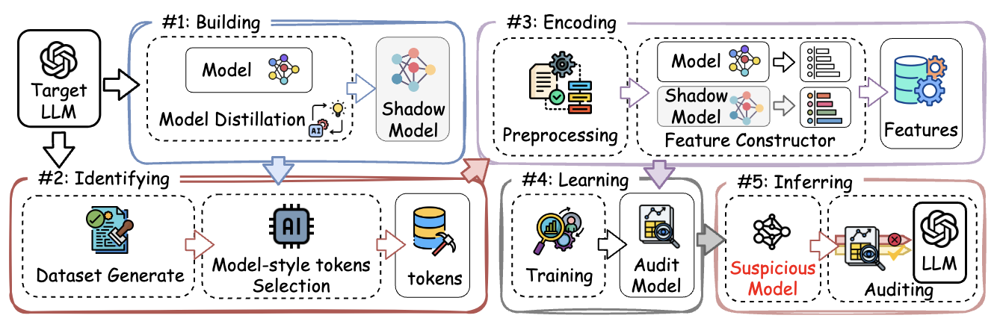

# Distillation Lineage Inspector

Our paper is available at [Distillation Lineage Inspector: Black-Box Auditing of Model Distillation in LLMs](XXXX).

## Abstract

Model distillation has emerged as a widely used technique for creating efficient models tailored to specific tasks or domains. However, its reliance on knowledge from foundation models raises significant legal concerns regarding intellectual property rights. To address this issue, we propose the Distillation Lineage Inspector (DLI) framework, which enables model developers to determine whether their large language models (LLMs) have been distilled without authorization, even in black-box settings where training data and model architecture are inaccessible. DLI is effective across both open-source and closed-source LLMs. Experiments show that DLI achieves 80\% accuracy with as few as 10 prompts in fully black-box settings and yields a 45\% improvement in accuracy over the best baseline under standard experimental conditions. Furthermore, we analyze how the auditor’s knowledge of target models influences performance, providing practical insights for building privacy-preserving and regulation-compliant AI systems.



## Environmental installation

First, I suggest manually installing GPU-related libraries, selecting the version that is compatible with your CUDA version. You can find the compatible version at [torch install guide](https://pytorch.org/).

```
pip3 install torch torchvision torchaudio
```

Then, to install other required packages, you can use following methods

Install from the `requirements.txt` file:

```
pip install -r requirements.txt
```

## About the data

You can also find the origin datasets here: [HealthCareMagic-100k](https://huggingface.co/datasets/RafaelMPereira/HealthCareMagic-100k-Chat-Format-en) and [QA-Legal](https://huggingface.co/datasets/ibunescu/qa_legal_dataset_train).

Please unzip the datasets to the `.\prompts` folder, you may find the following file structure.

```
|-- Data
    |-- HealthCareMagic-100k-en.jsonl
    |-- qa_legal.jsonl
```

## Examples and illustrate

There are 3 steps to run our experiment: preparation, audit and evaluation results. Below is a brief introduction on how to run these Python script files, with detailed comments available for reference in each file.

### 1. preparation

In this section, we preprocess the datasets, construct the shadow distillation model, and train the audit model.

The following code demonstrates how to build the shadow model on the `HealthCare` training set using the `llama3` model, employ `openai-community/gpt2-large` as a comparison model to select model-specific tokens, and train an audit model.

```
python audit_model_lineage.py \
--teacher_model_name="llama3" \
--compare_model_name="openai-community/gpt2-large" \
--dataset="HealthCareMagic" \
--setting="kt" \
--mode="prepare" \
--Gen_traing_data=True \
--Building=True \
--Identifying=True \
--Encoding=True \
--Learning=True \
```

You can change the parameter `teacher_model_name` with value `gpt4`, but you must first enter your OpenAI API keys in the `audit_model_lineage.py` file.

You can change the parameter `dataset` with value `legal`.

You can also change the parameter `compare_model_name` with any other models.

### 2. audit

To run audit, you can run following codes.

```
python audit_model_lineage.py \
--teacher_model_name="llama3" \
--compare_model_name="openai-community/gpt2-large" \
--dataset="HealthCareMagic" \
--setting="kt" \
--mode="test" \
--Gen_traing_data=True \
--Building=True \
--Identifying=True \
--Encoding=True \
--Learning=True \
```

### 3. evaluation results

After the previous part of the code has finished running, you should enter the trained audit model in the `model_lists.py` and then you can use the following code to evaluate the results:

```
python audit_eval.py \
--dataset="HealthCareMagic" \
--teacher_model_name="llama3" \
--compare_model_name="openai-community/gpt2-large" \
--method="kt" \
```

The `dataset` should be the same as previous code.


